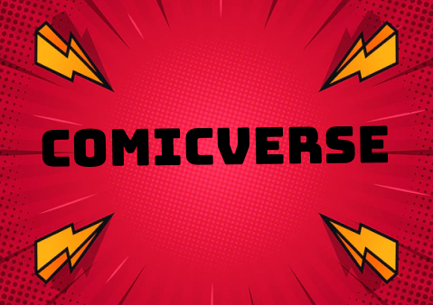

 
<h1 align="center">Welcome to Comicverse 🐱‍🏍</h1>

# Introduction

## Who are we?

 

We are a group of designers and developers from different parts of the world and of varying skill levels, collaborating together on full stack applications. We hope that these projects will not only help hone our skills but also provide some usefulness to those that use them.

## Project Description

Comicverse is a full stack application that is a place for comicbook enthusiasts to read comicbooks as well as share them with a bit of a twist! Stay tuned while we are still working out the details.

 

# Technologies used
## Design
- 

## Frontend
- 
- 
- 
- 

## Backend
- 

# Project Roadmap

## Current Todo

- ✅ ~~Designing web pages, logos and images~~ 9/5/2022
- ⬜ Developing frontend and backend - *In Progress*
- ⬜ Testing out kinks
- ⬜ Launching site
- ⬜ Site is now live